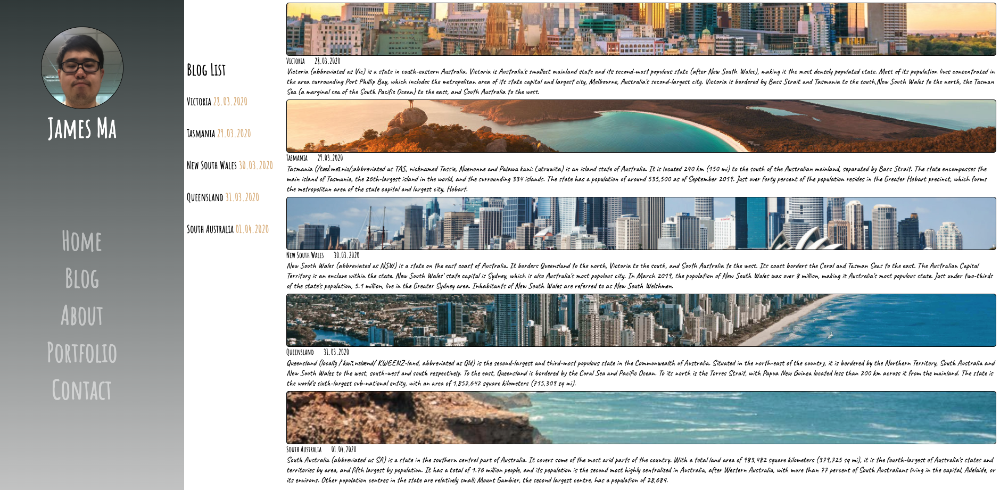
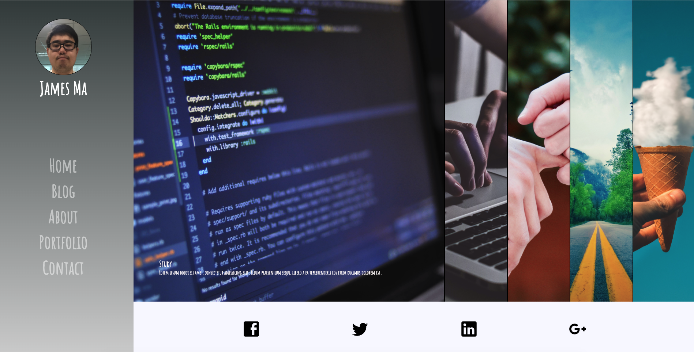

# James Ma Portfolio Website - T1A3

Website: https://nervous-roentgen-237032.netlify.com

Github: https://github.com/allenbad/Portfolio-basic

# Purpose

The purpose of the portfolio website is to present my skills, interests, and work history to potential employers and collaborators. This will enhance my visibility to others in the technology industry, which will assist in gaining employment or becoming involved with interesting projects.

As a developer, the website itself functions as an exhibition of software development and design capabilities. Therefore extra attention has been paid to designs which address modern concerns. These concerns include responsiveness to screens of different sizes, interactivity to encourage visitors to return to the site.

# Functionality and Features

### Component 1: Navigation Bar and Footer Bar

The site will include a navigation bar, which will include links to the other main pages of the website - home, blog, about, portfolio and contact - on each page. The navigation bar both informs visitors of the other pages available on the website, and allows them a way to visit them.

The navigation bar at the left of each page so the user will always know where they can go on each page to navigate around the website.

A footer bar is included with links to professional accounts -  LinkedIn Twitter Gmail and Github. This will allow visitors to view additional information such as my career prior to tech, personal projects, and a form that allow them more easy to get in contact with me if they wish.

### Component 2: List bar

You can easily find it in blog page. Can help you to find the blog location which you want to read.

### Component 3: Slider

The slider in portfolio page. It's a feature of my program. You can move the mouse on each picture and you will see the words in it. Just use CSS knowledge.

### A Consistent Style

All webpages use a consistent style, including components, fonts, colours, and themes

### Responsive Design

As visitors to the site may use a multitude of devices, the website has been designed to function well on screens of different sizes. 

### Subresource integrity

Subresource integrity ensures that the files delivered to your web application do not have any unexpected content such as malicious code injected by a third party.

This has been achieved by creating a hash using sha384 and using this hash as the value of the integrity attribute of our link tag. This ensures that styles.css will only load if it is identical to its state when the sha384 hash was created. If any changes have been made, the stylesheet will not be loaded and the HTML page will be displayed with no CSS styling.

# Sitemap

The website simply has all pages link to each other via the navigation bar. A sitemap for the website is presented below.

# Target audience

The target audience for the website falls into two categories:

1. Employers
2. Project Leads

The website is intended as a showcase of my abilities as a software developer and designer. The most likely use of the website is to provide as evidence of ability alongside a traditional application for employment. Additionally, employers or those leading other projects may chance upon the website and consider me for employment or inclusion in their projects.

# Tech stack

- HTML is used for the content of all webpages
- CSS is used for the styling and positioning of elements.
- Github is used for store the project.
- Netlify is used for web-hosting.

# Project Management

## Wireframes
Wireframes were created for each page for mobile and desktop screen widths during the planning phase of the project. Considering that 5 HTML pages were required. These are presented below.

##### Homepage

##### Blog

##### Portfolio

